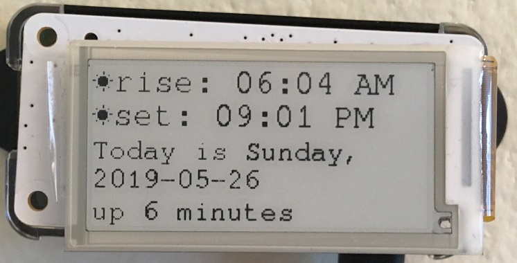

# Raspberry Launchpad

A utility providing information and functions helpful as you prepare to go
outside.

Uses a [PiPiRus e-ink display](https://github.com/PiSupply/PaPiRus#papirus) for
the Raspberry Pi Zero (W) and Python 3.

## Current features

* Sunrise and sunset
* High and low temperatures

## Planned

* Precipitation
* Measuring pet food/water bowl weights over time

## Requirements

* A PaPiRus HAT
* [PaPiRus libraries installed](https://github.com/PiSupply/PaPiRus#setup-papirus)
* Dependency packages:

    apt install python3 python3-defusedxml python3-requests
    pip install dateutil skyfield

## Attribution

* [no wifi by Gregor Cresnar from the Noun Project](https://thenounproject.com/term/no-wifi/488903/)
* [settings error by icon 54 from the Noun Project](https://thenounproject.com/term/settings-error/230271) (lines)
* [settings error by icon 54 from the Noun Project](https://thenounproject.com/term/settings-error/237416) (solid)
* [Arrow by Free Icons from the Noun Project](https://thenounproject.com/term/arrow/2540002)

## TODO

pipenv, configuration file, fpm package

* Accommodate locations like Barrow, Alaska
